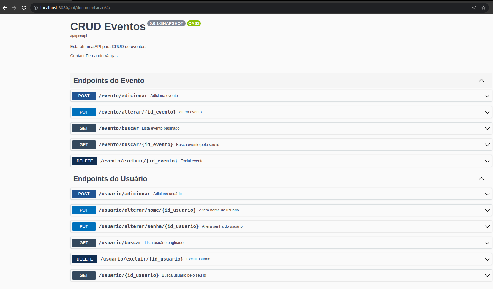

# **CRUD - Cadastro de Eventos**

Olá, para acessar a documentação da API e testa-la siga estes passos:

Tenha em seu computador o JDK 11 do Java e uma instância do PostgreSQL 15 (com usuário "postgres" e senha "postgres") com um banco de dados chamado "postgres".
<br>
Acesse a pasta root do projeto e o execute com o comando

```shell script
./mvnw quarkus:dev
```

Logo após acesse em seu navegador o seguinte endereço: http://localhost:8080/api/documentacao/

Você verá uma dela igual a esta: 
